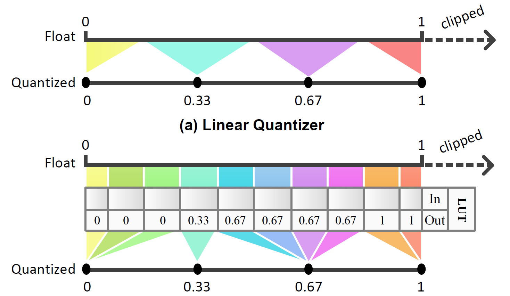
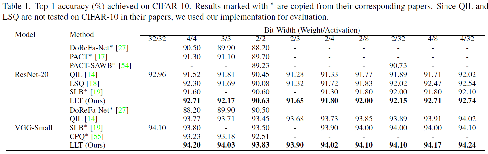
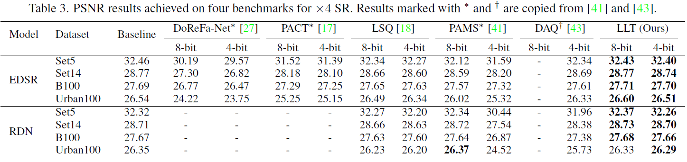
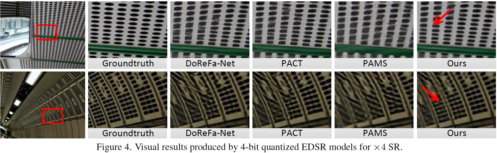
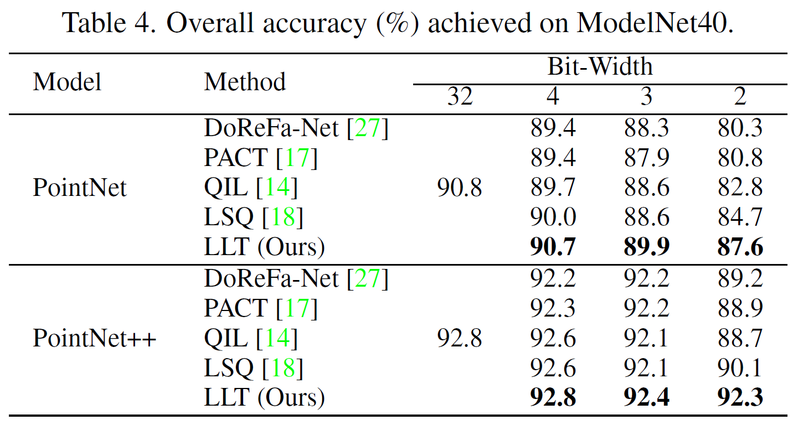

# LLT
Pytorch implementation of "Learnable Lookup Table for Neural Network Quantization", CVPR 2022

[[CVF]](https://openaccess.thecvf.com/content/CVPR2022/papers/Wang_Learnable_Lookup_Table_for_Neural_Network_Quantization_CVPR_2022_paper.pdf) [[Supp]](https://openaccess.thecvf.com/content/CVPR2022/supplemental/Wang_Learnable_Lookup_Table_CVPR_2022_supplemental.pdf)


## Overview

<p align="center">  </p>


## Image Classification (CIFAR-10)

### Requirements
- PyTorch
- TorchVision
- numpy

#### Train
1. Download pre-trained (full-precision models)[xx] and put them in `result`.

2. Begin to Train.
```bash
python train.py --arch resnet20 --epochs 200 --batch_size 128 --learning_rate 0.01 --weight_decay 1e-4 --w_bits 4 --a_bits 4
```

#### Test
```bash
python test.py --arch resnet20 --batch_size 128 --w_bits 4 --a_bits 4
```

### Results

<p align="center">  </p>

## Image Super-Resolution

### Train & Test

To be updated

### Results

<p align="center">  </p>

<p align="center">  </p>


## Point Cloud Classification

### Train & Test

To be updated

### Results

<p align="center">  </p>


## Citation
```
@InProceedings{Wang2022Learnable,
  author    = {Wang, Longguang and Dong, Xiaoyu and Wang, Yingqian and Liu, Li and An, Wei and Guo, Yulan},
  title     = {Learnable Lookup Table for Neural Network Quantization},
  booktitle = {CVPR},
  year      = {2022},
  pages     = {12423--12433},
}
```

## Acknowledgements
Part of our code is borrowed from [APot](https://github.com/thstkdgus35/EDSR-PyTorch). We thank the authors for sharing the codes.

